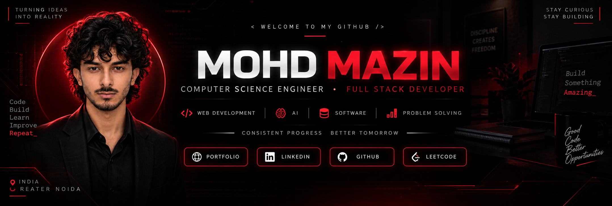

## 👋 About Me

I'm **Mohd Mazin**, a Computer Science Engineering student and Full Stack Developer who enjoys building practical web applications and solving programming problems.

- 🎓 Computer Science Engineering
- 💻 Full Stack Development
- 🐍 Python • ☕ Java • JavaScript
- ⚛️ React.js • Node.js
- 🗄️ SQL • MongoDB
- 🧩 Data Structures & Algorithms
- 🚀 Always learning, building, and improving

---

## 🛠️ Tech Stack

### Languages

### Frontend

### Backend & Database

### Tools

---

## 🚀 Featured Projects

### 🖤 Al-Noor Fashion

Premium e-commerce website for Burqas, Abayas & Kaftans.

---

### ✈️ Airline Reservation System

A software project for managing airline reservations and bookings.

---

### 🛫 Flight Booking System

A web-based flight booking application.

## 🧩 LeetCode

